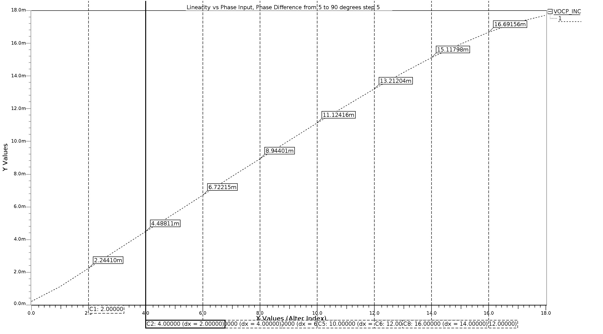
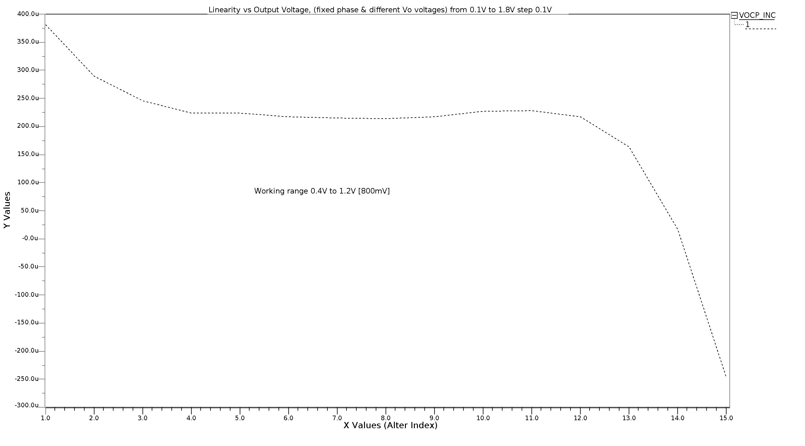

# Phase Frequency Detector with Charge Pump

Complete design and simulation of a phase frequency detector with a charge pump. Intended to be a part of a Phase Locked Loop design. The circuit was designed using Cadence Virtuoso. Once the schematic was captured and netlist generated, the work continued running Eldo simulations. Signal visualization was done using Ezwave.

For this project, I focused on ss (slow slow) corner and haven't run other corners. There shouldn't be any problems for tt, sf, and fs corners. Most likely, ff corner will require additional adjustment respective to a volume of the charge pump output capacitor.

For industry, it would require additional capacitance on each wire connection assigned a value according to the final chip layout.

Find the schematic [here](./pfd_cpump_schematics.pdf).

# Linearity vs Phase Input, phase difference from 5 to 90 degrees step 5

# Linearity vs Output Voltage, (fixed phase and different Vo voltages) from 0.1V to 1.8V degrees step 0.1V

